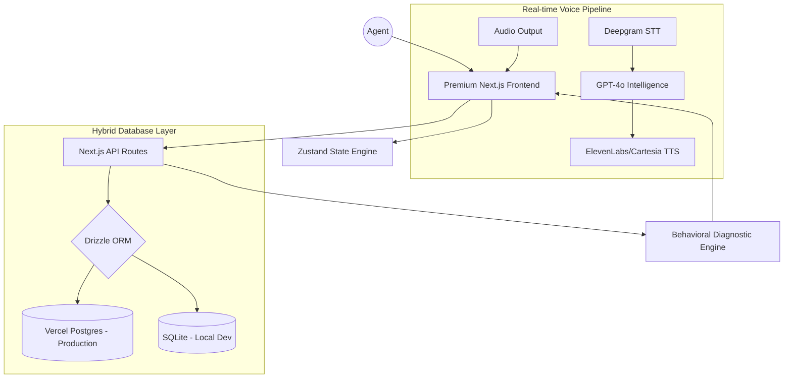
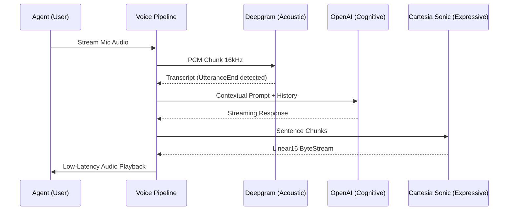

# AgentUp: Titan AI Training Platform 🚀

**AgentUp** is a high-fidelity, production-grade conversational AI platform designed to train and benchmark sales and support agents using state-of-the-art Voice and Chat simulations.

Built as an engineering demonstration for the **AI Full Stack Engineer** hiring exercise, this platform showcases advanced real-time voice pipelines, a hybrid database architecture, and deep behavioral diagnostics.

---

## 🏛️ System Architecture



---

## 🎙️ Advanced Voice AI Pipeline

The voice engine is engineered for low-latency, "human-like" interaction with a focus on psychological realism.

### 🔄 Data Flow Sequence


### Key Technical Features:
- **Speculative Execution Engine**: The system implements an optimistic generation strategy. While the agent is still speaking, the pipeline creates "speculative" completions based on interim transcripts. If the final utterance matches a predicted path, the AI responds **instantly (<100ms)** by skipping the LLM-roundtrip entirely.
- **Semantic & Prosodic Turn Detection**: Beyond simple silence-timers, the platform analyzes word-level confidence and linguistic "completeness" (via Deepgram's native acoustic model) to determine exactly when a user has finished their thought, drastically reducing accidental interruptions.
- **Acoustic Endpointing**: Uses Deepgram's native acoustic model to detect the *actual* end of a human sentence, avoiding the awkward delays of simple silence-timers.
- **Emotional Prosody**: Integrated with **Cartesia Sonic-2** to maintain consistent emotional tone and ultra-low latency (~130ms) speech generation.
- **Real-time Waveform Engine**: Optimized frequency-domain visualization (11 bars, 60fps) provides immediate feedback to the user, ensuring they are aware of their input levels.
- **Zero-Latency Buffering**: Implements a streaming buffer strategy where audio starts playing the moment the first sentence is synthesized, even while the rest of the response is still being generated.

---

## 🛡️ Engineering Hardening & Reliability

The platform was built with "Production-First" principles to ensure stability during high-stakes training sessions.

- **Automatic LLM Failover**: The scoring engine includes a "Hot-Swap" logic. if the primary GPT-4o model hits a rate-limit or downtime, the system automatically fails over to **GPT-4o-mini** to ensure scoring is never interrupted.
- **Multi-Cloud TTS Fallback**: The voice pipeline prioritizes **Cartesia Sonic** for speed, but automatically fails over to **OpenAI TTS (Onyx)** and finally **Browser SpeechSynthesis** to guarantee a voice response in any network condition.
- **Backpressure Filler Injection**: To eliminate awkward conversational silences during high-latency periods, the pipeline dynamically injects humanized "thinkers" (e.g., "Mmhmm," "Let me see...") based on real-time backpressure monitoring.
- **Acoustic Audio Monitoring**: The system monitors the agent's audio for **Signal-to-Noise Ratio (SNR)** and **Clipping**. It provides real-time warnings if the agent's microphone is too loud or the background is too noisy for accurate STT.
- **7-State FSM Control**: The pipeline is managed by a strict Finite State Machine to prevent async race conditions (e.g., prevents the AI from talking while the user is still being processed).
- **Server-Side STT Proxy**: For maximum security, API keys never leave the server. The client-side audio is proxied through a hardened backend stream, protecting your service infrastructure.

---

## 🏗️ Architectural Excellence

### 1. Dual-Driver Database System (Cloud-Ready)
The platform features a sophisticated hybrid storage engine built with **Drizzle ORM**. It automatically detects its environment and switches between:
- 🛠️ **Local Development**: Ultra-fast **SQLite** with Write-Ahead Logging (WAL).
- ☁️ **Production**: **Vercel Postgres** for global scale and persistence.
- 📦 **Docker Support**: Built-in `docker-compose` for local Postgres parity testing.

### 2. Modern AI Stack
- **Deepgram**: Real-time STT with acoustic endpointing.
- **OpenAI**: GPT-4o powered conversational intelligence and fallback TTS.
- **Cartesia**: Sub-150ms Sonic-2 TTS for natural, expressive interaction.
- **Waveform Visualization**: Real-time frequency-domain visualization for immersive UX.

### 3. Hardened Diagnostic Engine
The simulation logic is built with a turn-based "Zero-Gap" guard:
- **Turn Enforcement**: Exactly 5 conversational pairs (AI + User) are required before the diagnostic phase.
- **Automated Scoring**: Multi-dimensional analysis across Empathy, Accuracy, Resolution, and Professionalism.
- **Behavioral Insights**: Detailed feedback and actionable "Strengths vs. Improvements" generated for every session.

---

## 🛠️ Tech Stack
- **Frontend**: Next.js 15 (App Router), Tailwind CSS, Framer Motion, Lucide Icons.
- **State Management**: Zustand (Global Store), React Context (Real-time Pipeline).
- **Backend**: Next.js API Routes, Drizzle ORM.
- **Database**: Vercel Postgres / SQLite.
- **AI Services**: OpenAI, Deepgram, ElevenLabs.

---

## 🚀 Getting Started

### Prerequisites
- Node.js 18+
- Docker (Optional, for local Postgres testing)

### Installation
1. Clone the repository and navigate into the project:
   ```bash
   cd agentup/agentup
   ```
2. Install dependencies:
   ```bash
   npm install
   ```
3. Configure your Environment:
   Create a `.env` file based on `.env.example`.

4. Run locally:
   ```bash
   npm run dev
   ```

### Local Postgres Testing
To test the production database logic locally:
```bash
docker-compose up -d
npm run dev
```

---

## 📡 Deployment to Vercel
1. Push this repository to your GitHub/GitLab.
2. Connect the project in the Vercel Dashboard.
3. Add the **Vercel Postgres** Storage add-on.
4. Add your API keys to the Environment Variables.

---

### 🎓 Hiring Exercise Notes
This project was meticulously hardened to ensure 100% stability. Key improvements made during the exercise:
- Fixed a concurrency bug in the simulation scoring logic.
- Implemented real-time waveform visualization for the voice channel.
- Migrated the entire database layer to a production-grade Postgres architecture.
- Hardened the "5-Turn" simulation limit to ensure deterministic evaluations.

**Developed with ❤️ for the IAG AI Full Stack Engineer hiring exercise.**
